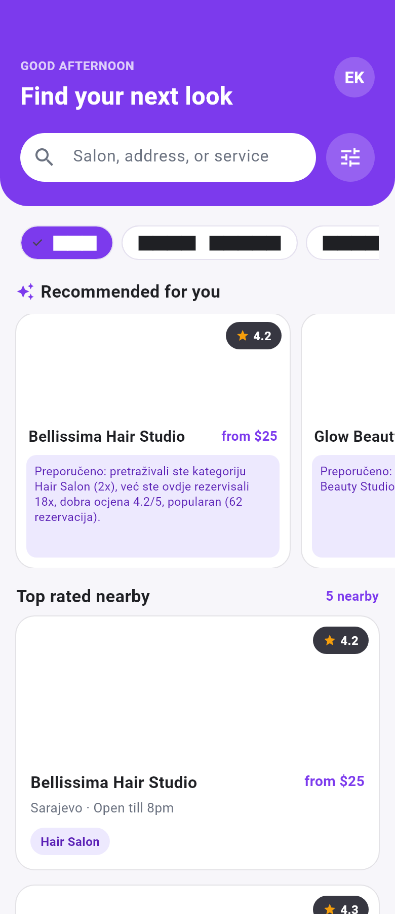

# Sistem preporuke — CutCal

Preporuke saloni prikazuju se korisniku (ulozi `Customer`) na početnom ekranu mobilne aplikacije u sekciji **Recommended for you**. Uz svaki salon prikazuje se i **objašnjenje** zašto je preporučen.

- Endpoint: `GET /Recommendations?lat=&lng=` (samo `Customer`, korisnik se uzima iz JWT-a)
- Implementacija: `backend/CutCal.Services/Services/RecommendationService.cs`
- Vrsta: hibridni, objašnjivi recommender — **content-based** (sličnost salona s onim što je korisnik već koristio) uz **popularity-based** i **quality-based** komponentu, te **udaljenost** kada je lokacija poznata.

## 1. Signali koji ulaze u preporuku

Svi signali se stvarno upisuju u bazu tokom korištenja aplikacije i svi se koriste u bodovanju.

| Signal | Gdje se upisuje | Tabela |
|---|---|---|
| Rezervacije korisnika (nisu otkazane) | kreiranje rezervacije | `Appointments` |
| Omiljeni saloni | dodavanje/uklanjanje favorita | `Favorites` |
| Pregled salona (otvaranje detalja) | `POST /Salons/{id}/View`, poziva se pri otvaranju ekrana salona; ponovni pregled istog salona unutar 10 minuta se ne broji | `SalonViews` |
| Pretraga po kategoriji | `GET /Salons?categoryId=` (klik na kategoriju na početnom ekranu) | `UserSearchHistories` |
| Recenzije korisnika | ostavljanje recenzije | `Reviews` |
| Ocjena salona (`AvgRating`) | preračunava se pri svakoj recenziji | `Salons` |
| Popularnost (broj rezervacija svih korisnika) | agregat nad rezervacijama | `Appointments` |
| Lokacija korisnika | šalje je mobilna aplikacija (`lat`, `lng`), ne čuva se | — |

## 2. Snaga interakcije korisnika sa salonom

Za svaki salon računa se koliko je korisniku "drag":

| Interakcija | Doprinos |
|---|---|
| Rezervacija (po komadu, ukupno najviše 6) | +3 |
| Favorit | +2 |
| Pregled (po komadu, ukupno najviše 2) | +0.5 |
| Prosječna ocjena koju je korisnik dao ≥ 4 | +1 |
| Prosječna ocjena koju je korisnik dao ≤ 2 | −2 |

Saloni s ukupnom snagom > 0 su **"sjemena"** (seeds) korisnikovog profila. Saloni s ukupnom snagom ≤ 0 se ne koriste kao sjemena.

## 3. Sličnost dva salona

`sim(A, B) = 0.6 · ista_kategorija + 0.2 · isti_grad + 0.2 · bliskost_cijena`

- `bliskost_cijena = 1 − min(|cA − cB| / max(cA, cB), 1)`, gdje je `c` prosječna cijena aktivnih usluga salona; ako cijena nije poznata, koristi se neutralnih 0.5.
- `sim(A, A) = 1`, pa salon koji je korisnik već koristio, pregledao ili spremio i sam dobija visok rezultat.

## 4. Komponente rezultata (sve u rasponu 0–1)

1. **History** — sličnost s korisnikovom historijom:
   `H(c) = Σ snaga(s) · sim(c, s) / Σ snaga(s)` po svim sjemenima `s`.
   Ako korisnik ima historiju pretrage kategorija, miješa se s interesom za kategoriju:
   `H'(c) = 0.75 · H(c) + 0.25 · min(broj_pretraga_kategorije, 3) / 3`.
   Ako nema nijednog signala, komponenta se izostavlja (cold start).
2. **Proximity** — `1 − min(udaljenost_km, 20) / 20` (haversine); izostavlja se ako lokacija nije poznata.
3. **Quality** — `AvgRating / 5`.
4. **Popularity** — `broj_rezervacija_salona / najveći_broj_rezervacija_među_salonima`.

## 5. Konačni rezultat

Ponderisani prosjek **samo komponenti koje su dostupne** za tog korisnika:

| Komponenta | Težina |
|---|---|
| History | 0.40 |
| Proximity | 0.20 |
| Quality | 0.25 |
| Popularity | 0.15 |

`score = Σ (težina · vrijednost) / Σ težina` (težine dostupnih komponenti se normalizuju).

Vraća se najviše 10 salona, sortiranih po `score` opadajuće.

**Cold start** (novi korisnik bez ijednog signala): koriste se samo Quality, Popularity i (ako postoji lokacija) Proximity, tj. preporuka je popularity-based.

## 6. Objašnjenje preporuke

Svaka preporuka nosi tekst `Reason`, sastavljen samo od signala koji su stvarno doprinijeli:

- sličan salonu X koji ste posjetili / iz vaših favorita / koji ste pregledali (ista kategorija, isti grad, sličan raspon cijena) — kada je sličnost ≥ 0.5,
- pretraživali ste kategoriju Y (Nx),
- već ste ovdje rezervisali Nx / pregledali ste ga Nx,
- u vašim favoritima,
- udaljenost od korisnika (ako je ≥ 0.5 proximity),
- odlična (≥ 4.5) ili dobra (≥ 4.0) ocjena,
- popularan (najmanje 3 rezervacije i ≥ 50% najpopularnijeg salona).

Primjer: `Preporučeno: pretraživali ste kategoriju Hair Salon (2x), već ste ovdje rezervisali 3x, 1.3 km od vas, dobra ocjena 4.2/5.`

Ako nijedan signal nije primjenjiv, prikazuje se: `Preporučeno na osnovu opće popularnosti salona.`

## 7. Konfiguracija

Sve težine i pragovi su imenovane konstante na početku klase `RecommendationService`; nema magičnih brojeva u samom izračunu.

## 8. Performanse

Jedan upit po vrsti signala (grupisanje u bazi po salonu), bez upita unutar petlje. Sličnost i bodovanje računaju se u memoriji nad učitanim salonima.

## 9. Izvorni kod glavne logike

`backend/CutCal.Services/Services/RecommendationService.cs`, metoda `GetRecommendationsAsync`:

```csharp
public async Task<List<RecommendationResponse>> GetRecommendationsAsync(int customerId, double? lat, double? lng)
{
    var salons = await _context.Salons.AsNoTracking()
        .Include(x => x.SalonCategory)
        .Include(x => x.City)
        .Include(x => x.WorkingHours)
        .Include(x => x.Services)
        .Where(x => x.IsApproved)
        .ToListAsync();

    var myBookings = await CountBySalonAsync(_context.Appointments.Where(x => x.CustomerId == customerId && x.StateName != AppointmentStateNames.Cancelled).Select(x => x.SalonId));
    var allBookings = await CountBySalonAsync(_context.Appointments.Where(x => x.StateName != AppointmentStateNames.Cancelled).Select(x => x.SalonId));
    var myViews = await CountBySalonAsync(_context.SalonViews.Where(x => x.UserId == customerId).Select(x => x.SalonId));
    var favorites = (await _context.Favorites.Where(x => x.UserId == customerId).Select(x => x.SalonId).ToListAsync()).ToHashSet();
    var myRatings = await _context.Reviews.Where(x => x.CustomerId == customerId && !x.IsRemoved)
        .GroupBy(x => x.SalonId)
        .Select(g => new { SalonId = g.Key, Rating = g.Average(r => r.Rating) })
        .ToDictionaryAsync(x => x.SalonId, x => x.Rating);
    var categorySearches = await _context.UserSearchHistories.Where(x => x.UserId == customerId)
        .GroupBy(x => x.SalonCategoryId)
        .Select(g => new { CategoryId = g.Key, Count = g.Count() })
        .ToDictionaryAsync(x => x.CategoryId, x => x.Count);

    var candidates = salons.Select(s => new Candidate(
        s,
        s.Services.Where(x => x.IsActive).Select(x => (decimal?)x.Price).Average(),
        lat.HasValue && lng.HasValue ? SalonManagementService.DistanceKm(lat.Value, lng.Value, s.Latitude, s.Longitude) : null)).ToList();

    var seeds = candidates
        .Select(c => new Seed(
            c,
            InteractionStrength(c.Salon.Id, myBookings, myViews, favorites, myRatings),
            myBookings.GetValueOrDefault(c.Salon.Id),
            favorites.Contains(c.Salon.Id)))
        .Where(x => x.Strength > 0)
        .ToList();

    var maxBookings = Math.Max(allBookings.Values.DefaultIfEmpty(0).Max(), 1);
    var maxSearches = categorySearches.Values.DefaultIfEmpty(0).Select(x => Math.Min(x, SearchCountCap)).Max();

    var results = candidates.Select(c =>
    {
        var bestSeed = seeds
            .Where(s => s.Candidate.Salon.Id != c.Salon.Id)
            .OrderByDescending(s => s.Strength * Similarity(c, s.Candidate))
            .FirstOrDefault();

        double? history = seeds.Count > 0
            ? seeds.Sum(s => s.Strength * Similarity(c, s.Candidate)) / seeds.Sum(s => s.Strength)
            : null;

        var searchCount = categorySearches.GetValueOrDefault(c.Salon.SalonCategoryId);
        double? searchInterest = maxSearches > 0 ? (double)Math.Min(searchCount, SearchCountCap) / SearchCountCap : null;
        if (searchInterest.HasValue)
        {
            history = history.HasValue
                ? (1 - SearchShareInHistory) * history.Value + SearchShareInHistory * searchInterest.Value
                : searchInterest;
        }

        double? proximity = c.DistanceKm.HasValue ? 1 - Math.Min(c.DistanceKm.Value, MaxDistanceKm) / MaxDistanceKm : null;
        var quality = c.Salon.AvgRating / 5.0;
        var bookingCount = allBookings.GetValueOrDefault(c.Salon.Id);
        var popularity = (double)bookingCount / maxBookings;

        var components = new List<(double Weight, double Value)>
        {
            (WeightQuality, quality),
            (WeightPopularity, popularity)
        };
        if (history.HasValue) components.Add((WeightHistory, history.Value));
        if (proximity.HasValue) components.Add((WeightProximity, proximity.Value));
        var score = components.Sum(x => x.Weight * x.Value) / components.Sum(x => x.Weight);

        var response = c.Salon.Adapt<SalonResponse>();
        response.DistanceKm = c.DistanceKm.HasValue ? Math.Round(c.DistanceKm.Value, 2) : null;

        return new RecommendationResponse
        {
            Salon = response,
            Score = Math.Round(score, 4),
            Reason = BuildReason(c, bestSeed, searchCount, proximity, myBookings.GetValueOrDefault(c.Salon.Id), myViews.GetValueOrDefault(c.Salon.Id), favorites.Contains(c.Salon.Id), bookingCount, popularity)
        };
    });

    return results.OrderByDescending(x => x.Score).Take(MaxResults).ToList();
}
```

## 10. Preporuke u pokrenutoj aplikaciji

Ekran Discover (mobilna aplikacija), sekcija **Recommended for you**, sa stvarno generisanim objašnjenjem:



> Preporučeno: pretraživali ste kategoriju Hair Salon (2x), već ste ovdje rezervisali 18x, dobra ocjena 4.2/5, popularan (62 rezervacije).
